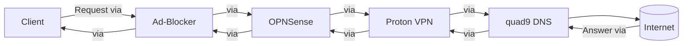

sqq# Self-hosted-DNS-Resolver
I'm making an own DNS-Resolver this year, it's self-hosted and the devices, are connected via tailscale. It's an combination out of an ad-blocker, an firewall, an VPN an quad9 DNS, probably more (maybe deep packet injection).

## You've must have installed Tailscale, to get this working correctly!

How it's going to work: On your phone, laptop or whatever, your typing in your servers address as custom DNS-Address. If your try to open an website for example, the system will first pass an ad-blocker, then an firewall (opnsense), after that it's routet via Proton VPN in an Docker Container to the quad9 DNS server and the internet. Propably, I will add deep packet injection.

