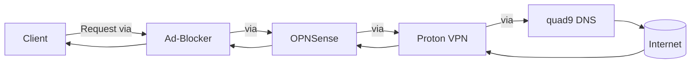

sqq# 

Self-hosted-DNS-Resolver
I'm building my own DNS-Resolver this year, it's self-hosted and the devices, are connected via tailscale. It's a combination of an ad-blocker, a firewall, a VPN an quad9 DNS.

I'm going to set ist up via the tool containerlab (https://containerlab.dev). With that, I'm able to simulate real, physical networks, just with containers instead of devices.

## You must have installed Tailscale, to get this working correctly!

How it's going to work: On your phone, laptop or whatever, you type in your servers address as custom DNS-Address. If you try to open a website for example, the system will first pass an ad-blocker, then a firewall (opnsense)(with deep packet injection). After that it's routed via Proton VPN in a Docker Container to the quad9 DNS server and the internet.

AdBlocker py-hole:
https://github.com/pi-hole/docker-pi-hole/#running-pi-hole-docker

Firewall OPNSense:
https://docs.opnsense.org/

Proton VPN as Docker Container:
https://github.com/tprasadtp/protonvpn-docker

quad9:
https://quad9.net/

The Ad-Blocker and Proton will be started in an Ubuntu VM in Proxmox VE. OPNSense uses its own VM (Maybe convert to container for containerlab?)

Containerlab:
https://containerlab.dev
